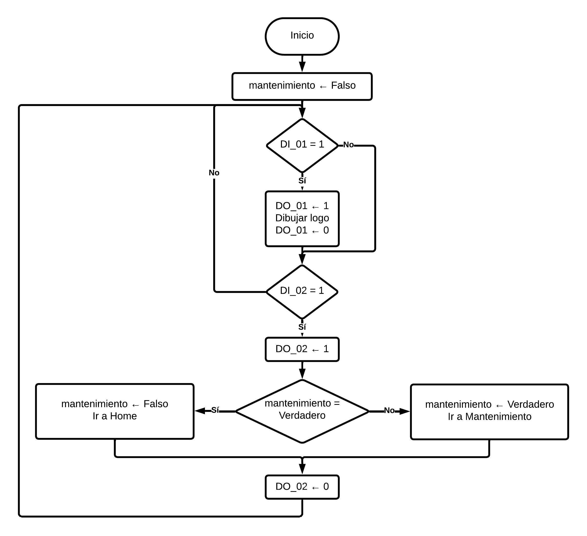

# Lab1_Robotica_Aguilar_Tovar

## Contenido repositorio

## Solución planteada
Para el desarrollo de este laboratorio se realizaron los siguientes pasos
1. Se eligieron dos marcas para poder trabajar. en este caso Tikto y Nike.
2. Se buscaron los logos y se modelaron en Inventor agregando las iniciales de los nombres de los integrantes del equipo.
3. Se modeló la herramienta que se uso en el montaje.
4. En RobotStudio se configuró la herramienta, los logos, se creó un objeto de trabajo, se crearon las trayectorias y se hizo la programación en RAPID con las entradas y salidas digitales.
5. Se simularon las trayectorias.
6. Se implementó en el laboratorio.

## Diagrama de flujo de acciones del robot
El siguiente diagrama describe el accionamiento del robot en todos los casos, la variable _mantenimiento_ determina si se encontraba en dicha posición, las entradas digitales son DI_0X mientras que las entrada son DO_0X.

  

## Plano de planta elementos

## Diseño de la herramienta

## Código en RAPID

## Videos

Los resultado de las distintas pruebas se consignan la siguiente lista de reproducción de [Youtube](https://www.youtube.com/watch?v=hpt4hrAIyEk&list=PLRvQ_9G7W0KRISnKxF9upumXdgGfY8UST)
