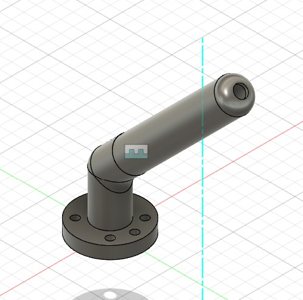
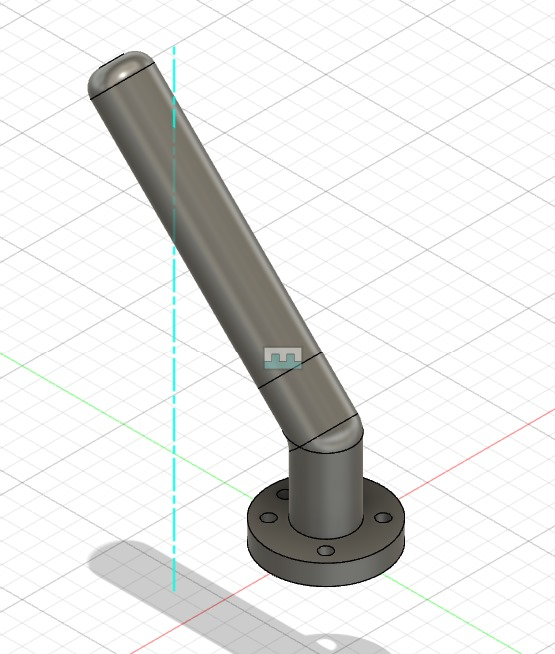
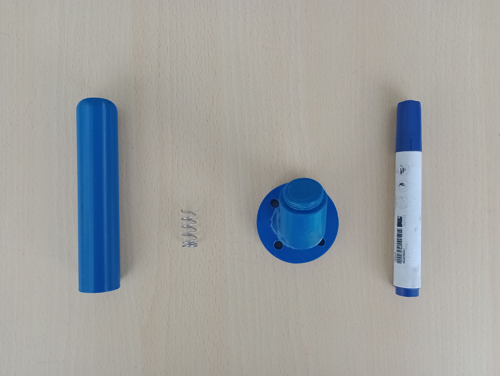
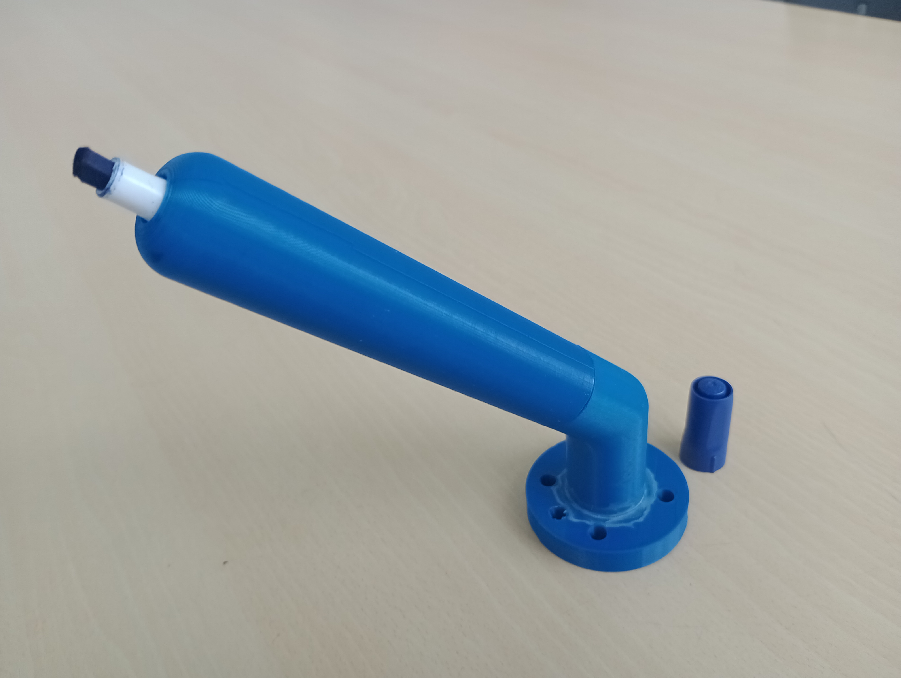
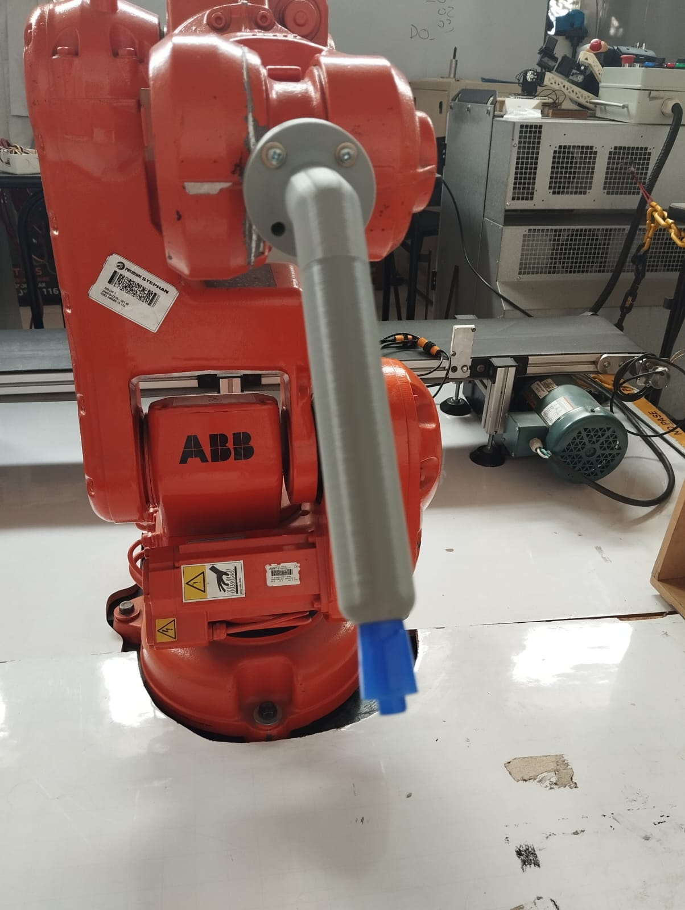
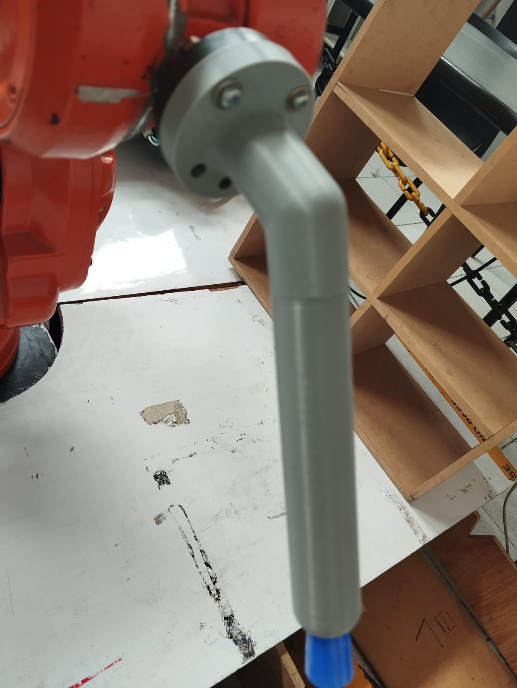
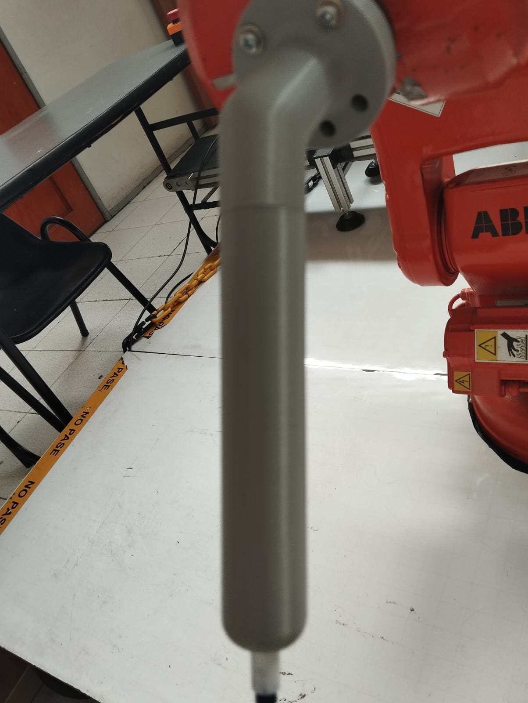
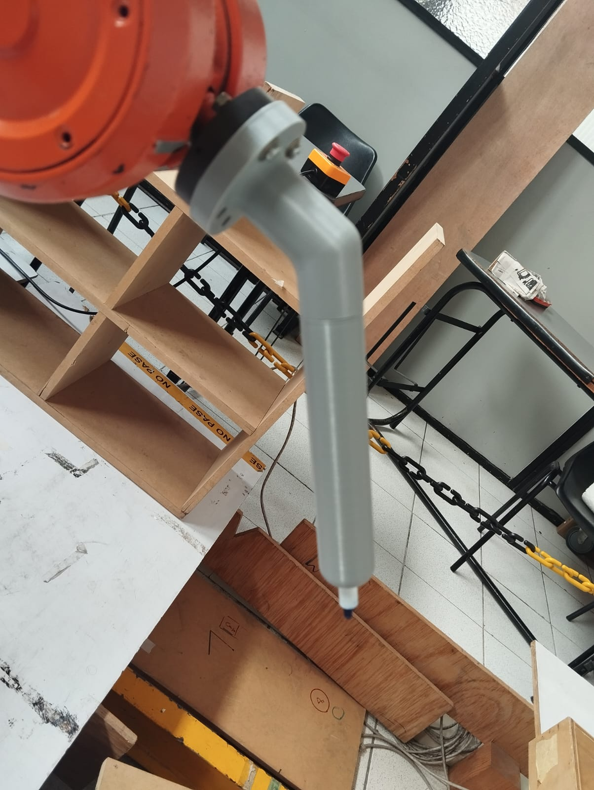

# Lab1_Robotica_Aguilar_Tovar

## Índice
1. [Contenido del repositorio](#contenido-repositorio)
2. [Solución planteada](#solución-planteada)
3. [Diagrama de flujo de acciones del robot](#diagrama-de-flujo-de-acciones-del-robot)
4. [Diseño de la herramienta](#diseño-de-la-herramienta)
5. [Videos](#videos)

## Contenido repositorio
La carpeta _Nike_ contiene el proyecto de lo trabajado en la marca Nike, de manera análoga _Tiktok2_ contiene lo trabajado en la marca Tiktok; ambas carpetas contienen las estaciones y los controladores que se generaron en RobotStudio. La carpeta _media_ contiene las imágenes de este documento, los archivos _HerramientaMarcadorEnsamblada v1.sat_ y _Silueta_nike_nombres.ipt_ contienen el cad de la herramienta (como un solo cuerpo) y la silueta generada para Nike.

## Solución planteada
Para el desarrollo de este laboratorio se realizaron los siguientes pasos
1. Se eligieron dos marcas para poder trabajar, en este caso Tiktok y Nike.
2. Se buscaron los logos y se modelaron sobre una placa en Inventor agregando las iniciales de los nombres de los integrantes del equipo.
3. Se modeló la herramienta que se uso en el montaje y se realizó su impresión en 3D.
4. En RobotStudio se configuró la herramienta, los logos usando las placas modeladas anteriormente, se creó un objeto de trabajo sobre dichas placas, se crearon las trayectorias con base a las aristas de las placas y se hizo la programación en RAPID con las entradas y salidas digitales.
5. Se simularon las trayectorias.
6. Se implementó en el laboratorio.

## Diagrama de flujo de acciones del robot
El siguiente diagrama describe el accionamiento del robot en todos los casos, la variable _mantenimiento_ determina si se encontraba en dicha posición, las entradas digitales son DI_0X mientras que las entrada son DO_0X.

  

## Diseño de la herramienta
La herramienta se divide en 3 cuerpos: una base que se conecta al robot, un resorte para no oprimir de sobre manera el marcador y un cuerpo cilíndrico que sostiene el marcador. La base y el cilindro son roscados lo que permite reemplazar el marcador en cualquier momento. Su diseño en cada es el siguiente:

  

  

Se imprimieron dos modelos de prueba que se presentan a continuación:

  

  

  

  

  

  

## Videos

Los resultado de las distintas pruebas se consignan la siguiente lista de reproducción de [Youtube](https://www.youtube.com/watch?v=hpt4hrAIyEk&list=PLRvQ_9G7W0KRISnKxF9upumXdgGfY8UST), se presentan 6 videos: 3 simulaciones y 3 resultados en laboratorio.
